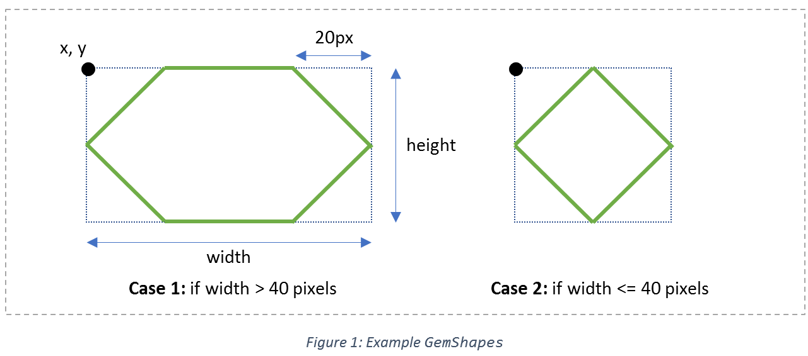
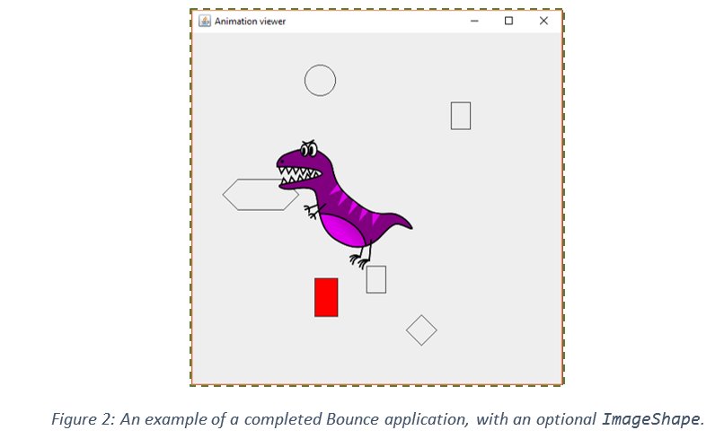

Industry Lab 12: Bounce
==========
## About this lab
In today’s lab, we will be modifying an existing application called Bounce. Bounce involves an animation comprising an extensible set of shape types. Shapes have in common knowledge of their position, velocity, direction, and bounding box, while each kind of special shape has a specific way of rendering itself.

Note: the changes you make to the Shape class hierarchy should not break any existing code (e.g. the **AnimationViewer** class) that has been written to use the hierarchy.

## Exercise One: Model the Bounce Package
Create a UML class diagram to model the static structure of the Bounce application. Your class diagram should capture the key classes and interfaces, and the relationships between them.

Next, create a sequence diagram to reveal how instances of the classes work together. The sequence diagram should capture important interactions between key instances of the classes. Here is an example scenario to model:
* The **AnimationViewer**’s object knows of exactly two **RectangleShape** instances.
* The scenario starts with the Timer generating an Action event.
* The sequence diagram should expose object interaction in response to the **ActionEvent** that results in the **RectangleShape** objects being painted and moved.

`Note: You do not need to include the classes associated with testing.`

## Exercise Two: Add an Oval Shape
Create an **OvalShape**, a new type of Shape, which moves like the other shapes but displays itself as an oval shape that fits into its bounding box. It must be possible to create an **OvalShape** using the same set of creation options as offered by class Shape. Implement **OvalShape** and include such a shape in your animation.

## Exercise Three: Add a Gem Shape
Create a **GemShape**, a new type of Shape, which moves like the other shapes but displays itself as a hexagonal shape that fits into its bounding box. It must be possible to give values for instance variables at construction time or rely on default values. Implement **GemShape** and include such a shape in your animation.

The **GemShape** is to be painted to fit within the given width and height. You may use either **drawLine()** or **drawPolygon()** calls to the Painter to draw the gem.

The definition of the coordinates of the points is phrased here in terms of *(x, y, width, height)*:
The top-left and bottom-left vertices of a **GemShape** are normally 20 pixels to the right of the left-hand side of the shape. Similarly, the top-right and bottom-right vertices of a **GemShape** are normally 20 pixels to the left of the right hand side of the shape. However, if the width of a **Gemshape** is less than 40 pixels, the top-left and top-right vertices are both positioned at point <b>*(x + width/2, y)*</b>. Similarly, the bottom-left and bottom-right vertices are both positioned at point <b>*(x + width/2, y + height)*</b>. In other words, “small” **GemShapes** are four-sided figures.

Once you’ve created your **GemShape class**, add at least two **GemShapes** to your animation (one of each kind shown above).

## Exercise Four: Add a Dynamic Rectangle Shape
Create a **DynamicRectangleShape**, a new type of Shape, which paints itself similarly to a **RectangleShape**. At construction time, an additional `java.awt.Color` argument can be supplied. If not given, the new **RectangleShape** object’s colour should default to black.

A **DynamicRectangleShape** moves like the other shapes, but it sometimes changes its appearance when it bounces. After it bounces off the left or right wall, it paints itself as a solid figure, in the colour specified at construction time. After it bounces off the top or bottom wall it switches its appearance to that of a **RectangleShape**, i.e. rendering itself with an outline. If it bounces off both walls, the vertical (left or right) wall determines its appearance.

Implement it and include such a shape in your animation.

Note: You should use good design principles when creating this class. If you find yourself copying and pasting the contents of **Shape’s move()** method into a subclass, you should think of a better way!

## Exercise Five: Add your Own Shape
For this exercise, you can design any new kind of shape you like. For example, you could create an **ImageShape**, which would move like other shapes but displays an image (e.g. <b>a *.png file</b>). Your shape should demonstrate usage of some feature not covered in class (e.g. **image display**).

